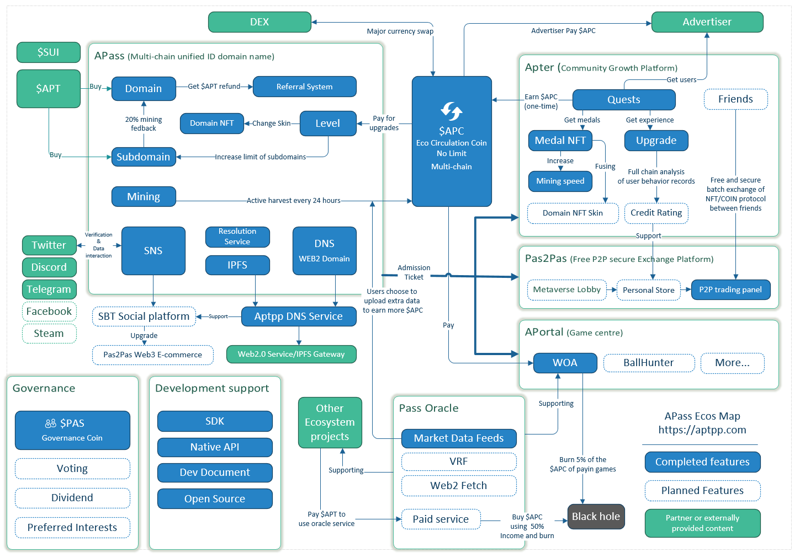

# 🔓 Private Trade

You can create a private transaction, simply set the assets you want to offers and wants and confirm, you will get a transaction chain and transaction code. Send it to your friends and start trading.

### Transaction process

You can create multiple trades.

A trade may have several states:

* **Trading** transaction in progress, waiting for friends to trade
* **Completed** The transaction is completed, both seller and buyer complete the asset exchange
* **Seller Confirm** waits for the project initiator (seller) to confirm and complete the transaction, which only occurs when two-step confirmation is required.

### Specified buyer

When creating a trade, if the specified buyer is checked, it will be valid after entering the address or domain name to verify the validity. For the trade of the designated trading party, other people who know the TRADE-ID can view them, but cannot trade them. This option is especially useful in cases of gifting assets (the wants list is empty).

### General Trade Process

<figure><figcaption></figcaption></figure>

To create a general trade steps are as follows:

1. Set the NFT, token and amount of "Offers", up to 4 items&#x20;
2. Set the NFT, token and amount of "Want", up to 4 items&#x20;
3. Submit the creation application, and get a TRADE-ID and link after success&#x20;

Friend trading steps:

1. Send TRADE-ID or link to friends via social media or chat tools&#x20;
2. Friends enter through the link, or use TRADE-ID on the UniBazaar Homepage to enter
3. If the friend accepts the transaction and the assets meet the transaction requirements, just click the TRADE button.
4. If a wants of NFT is set for the trade, the friend needs to select the specified NFT and fill it before starting the transaction.
5. Once the trade is complete, your friend will get you "offers" assets, and you will get the "wants" assets from your friend.

### Two-Step confirmation

When creating a new trade, if you add NFT items into "wants" list and check the Two-Step confirmation, the process is somewhat different from the general trade process.

<figure><figcaption></figcaption></figure>

### **Transaction Fee**&#x20;

By default, when creating a transaction, you need to pay a transaction fee of 0.5 $APC (priority deduction) or 0.1 $APT. If you registers and binds a AptosPassport domain name, there is no transaction fee at all. Of course, the gas fee is still essential.

### Cancel Trade

If the transaction status is "Trading", the user can find the trade in "My Log" page at any time, Click "Cancel Trade", and get back the offers assets. The trade will be deleted. Transaction fees will not be refunded.

If the transaction status is "Seller Confirm”, that is, the transaction has opened the second confirmation and is waiting for the transaction initiator (seller) to confirm, the seller can reject the transaction and return the assets provided by the buyer, and the buyer can also go back and get the assets back at any time. If either party chooses to reject the transaction, the transaction status will return to "Trading".
